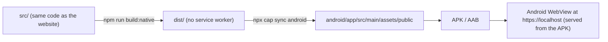

# Android app

Ease ships on Android as a [Capacitor 8](https://capacitorjs.com) app: the same React build, bundled into the
APK and shown in an Android WebView. There is no server and no network use: every file is inside the app, and
the app does not even hold the `INTERNET` permission.



## Requirements

- Node 22, npm.
- Android Studio (Ladybug or newer) with Android SDK 36. Its bundled JDK 21 is used for Gradle.
- A device or emulator on Android 7.0 (API 24) or newer.

## Everyday workflow

```bash
npm run android        # build:native + cap sync + open Android Studio, then press Run
npm run android:sync   # rebuild the web part and copy it into android/ (Studio already open)
```

`npm run build:native` is `tsc -b && vite build --mode native`. Native mode turns off the PWA service worker:
the APK already holds every file, and a second cache would only risk serving old files after an update.
Always sync after a web change; the APK only contains what was synced.

If Android Studio shows **Gradle: Build Error** right after opening the project, the usual cause is the Gradle JDK:
Capacitor 8 needs JDK 21, and a system Java 17 is not enough. In Studio open Settings > Build, Execution, Deployment >
Build Tools > Gradle and set **Gradle JDK** to the embedded JDK (`jbr-21`), then File > Sync Project with Gradle Files.

Command-line builds (no Studio):

```bash
export JAVA_HOME="/Applications/Android Studio.app/Contents/jbr/Contents/Home"
cd android && ./gradlew assembleDebug        # app/build/outputs/apk/debug/app-debug.apk
adb install -r app/build/outputs/apk/debug/app-debug.apk
```

## The app layout (not the website)

In the app the UI is a dedicated layout, not the website in a wrapper. It is switched on by `isApp` in
`src/native.ts` (always on in the Android app; in `npm run dev` add `?app=1` to preview it in a browser; never on in a
production website build). `<html data-app>` is set before the first render, and the Tailwind `app:` variant
(`src/index.css`) applies only under it, so the website's classes and behaviour are unchanged.

| Website | App |
|---|---|
| Logo header on every page, big page headings | Top app bar: logo on Home, a title on each tab, a back arrow on detail screens (the title fades in when you scroll) |
| Dot-style tab bar that hides on scroll; desktop top nav | Material navigation bar with a pill indicator; a rail on tablets and in landscape; hidden on detail screens |
| "‹ Home" text link, footer with links | System-style back arrow; no footer (About, version and feedback live on Safety) |
| Cards with their own borders | One rounded surface per list, with dividers |
| Inline "Start routine / Start press" buttons | Bottom action bar on detail screens |
| Body-map result under the figure; `<select>` for channels | Bottom sheets (body-map result, channel filter) |
| Hover and focus styles | Touch ripple, press states, no text selection, no overscroll glow |
| Pages swap instantly | Short slide/fade transitions (none for reduced motion) |

Code: `src/components/app/` (`AppChrome.tsx` bar and nav, `barContext.ts`, `ChannelSheet.tsx`), `AppLayout` in
`src/App.tsx`, `initRipple` in `src/native.ts`. A detail screen gives the bar its title with `<AppBarTitle>`.
System back also closes a bottom sheet (`data-back-closes`) before leaving the screen.

Known limit: on a landscape phone (about 400 px tall) the point screen is cramped but scrollable.

## What is native, and where

| Concern | How | Where |
|---|---|---|
| Back button / gesture | Closes the guided press, then goes back in the WebView's own history (Capacitor's `canGoBack`), then Home, then backgrounds the app. | `src/native.ts`, `src/App.tsx` |
| Links that leave the app | `http(s)` links to other hosts open in a browser Custom Tab (`@capacitor/browser`); `mailto:` hands off to the mail app. The app WebView never leaves `https://localhost`. | `src/native.ts` |
| Screen stays on during a press | `@capacitor-community/keep-awake` (Android WebView has no Wake Lock API); released on pause, finish or close. Only the latest request can release it, so a quick pause/resume never lets the screen sleep mid-press. | `src/native.ts`, `PressSheet.tsx` |
| Splash | Android 12 splash API: paper background + Ease mark; hidden after the first render, with a 3 s fallback so it can never stick. | `res/values/styles.xml`, `res/drawable/splash_icon.xml` |
| Status and navigation bars | Capacitor SystemBars, `insetsHandling: native`: the WebView sits between the bars, the window behind them is paper (dark: night paper). | `capacitor.config.ts`, `res/values*/colors.xml` |
| Light / dark | A sun/moon button in the top bar and an **Appearance** card on Safety (System, Light, Dark). The choice is saved in localStorage and mirrored to native storage. `src/theme.ts` applies it as `data-theme` on `<html>` (the CSS `theme-dark` variant reads it), and `MainActivity.EaseNative` gives the page the system theme at start (`isDark`) and lets it set the status/navigation bar icons and window colour (`setBars`). System switches while the app is open reach the page as an `ease-system-theme` event, which it ignores if you picked Light or Dark. The activity is not restarted, so a running timer survives. | `src/theme.ts`, `MainActivity.java`, `src/index.css` |
| Icon | Adaptive vector icon (ring + dot on paper) with a monochrome layer for themed icons; PNGs for API 24-25. | `res/drawable/ic_launcher_*.xml`, `res/mipmap-*` |
| Saved answer | The pregnancy answer is kept in localStorage and mirrored to native SharedPreferences (`@capacitor/preferences`), which is the source of truth at startup: the WebView writes its storage to disk about a second late, so a fast kill could otherwise lose it. | `src/native.ts`, `usePregnancyStatus.ts` |
| Privacy | No `INTERNET` / network-state permission (removed even if a library adds it). Cloud backup and device transfer are off, so the pregnancy answer never leaves the phone. | `AndroidManifest.xml`, `res/xml/data_extraction_rules.xml` |

Debug builds can be inspected from `chrome://inspect`; release builds cannot.

The website build is unchanged by all this (every native call is a no-op in a browser, and the website keeps
its service worker). The plugins' small web shims do ship in the website bundle.

## Release to Google Play

1. **Version.** In `android/app/build.gradle` raise `versionCode` (integer, +1 every upload) and set
   `versionName` (for example `1.0.0`).
2. **Upload key (once).** Android Studio > Build > Generate Signed App Bundle > create a new keystore. Keep the
   `.jks` file and its passwords outside the repo (a password manager plus an offline backup). `*.jks` and
   `*.keystore` are git-ignored. Enrol in **Play App Signing** when Play Console offers it; then a lost upload
   key can be reset.
3. **Build the bundle.** `npm run android:sync`, then Build > Generate Signed App Bundle > release. Output:
   `android/app/release/app-release.aab`.
4. **Play Console** (Create app: name "Ease", app, free):
   - **Privacy policy:** https://fluxogen.github.io/legal/ease/privacy/
   - **Data safety:** no data collected, no data shared. (The pregnancy answer is stored on the device only
     and never transmitted, which Play does not count as collection.)
   - **Health apps declaration:** wellness / self-care education; not a medical device. Content says
     "traditionally used for", never "treats".
   - **Ads:** no. **Content rating:** complete the questionnaire (reference health info, no user content).
   - **Target audience:** 18+ (matches the privacy policy; not designed for children).
   - **Store listing:** short description, full description, 512 px icon (`public/android-chrome-512x512.png`
     is the web icon; export the adaptive icon from Studio's Image Asset tool for an exact match), feature graphic
     1024 x 500, at least 2 phone screenshots.
5. **Testing track first.** Upload to Internal testing, install from the Play link on a real phone, run the
   checklist below, then promote to Production.

## Device checklist (before each release)

- Fresh install opens straight to Home (no blocking question); the optional pregnancy card works; the answer survives a restart.
- Home > routine > point > Start press; back closes the press, then returns routine > Home > leaves the app.
- Screen stays on during a press; pause releases it.
- Privacy / source links open in the browser; Contact opens the mail app; returning lands on the same page.
- Airplane mode: cold start, every tab, photos and drawings load.
- Dark mode, landscape, largest font size, 3-button navigation: nothing cut off, no sideways scroll.

The same checks were automated against an emulator (Playwright Android + adb) when the app was set up; see the
PR for results.
