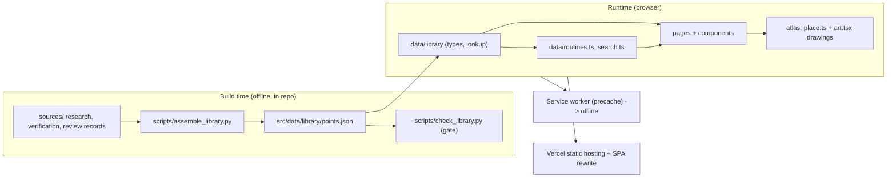
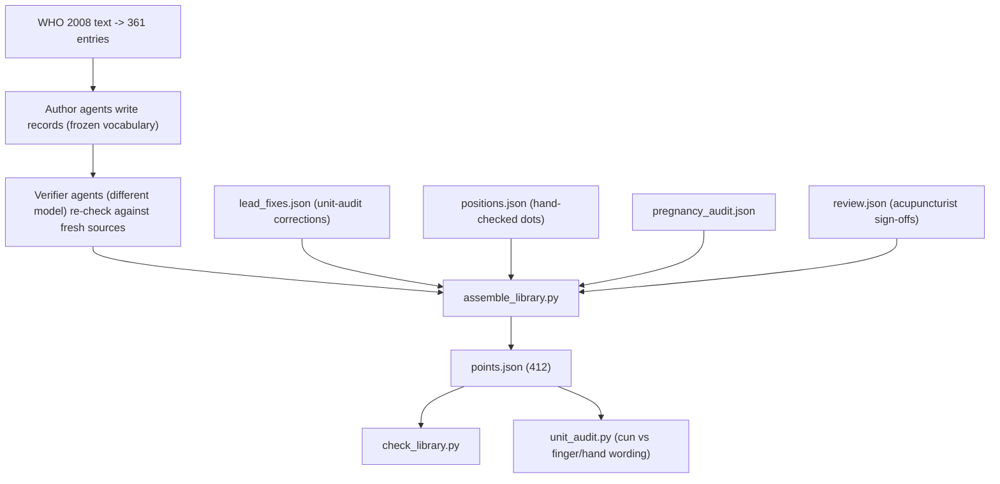
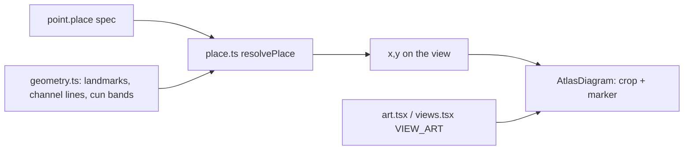

# Ease architecture

How Ease is put together and why. For setup see the [README](../README.md); for UI rules see
[design-system.md](design-system.md); for data rules see [library-pipeline.md](library-pipeline.md).

## 1. Shape of the system

Ease is a static single-page app. There is no server and no database. The whole library ships as one JSON
file, and a service worker makes it work offline. The only user data is the pregnancy answer in
`localStorage` (`ease.pregnancyStatus`). Nothing is sent anywhere.

Why static: the content is small (about 2 MB total), changes only by a deliberate rebuild, and must work
with no signal. A backend would add cost, a privacy surface and an offline problem for no benefit.

## 2. Data pipeline (build time)

Phases and gates are defined in [library-pipeline.md](library-pipeline.md). The code side:

`assemble_library.py` applies, in order: verifier fixes override author fields; flashcard sites are dropped
as sources; a non-WHO point needs at least two independent references or it is left out; an indication needs
at least two counted sources; the tag table (`TAG_RULES`) maps indication keywords to symptom tags;
pregnancy is true if the author flag, the audit flag or the lower-belly/sacrum region rule says so, and the
`pregnancy` caution mirrors it; lead fixes and review results are applied last.

Each point (`LibraryPoint`, `src/data/library/index.ts`) carries: `id, code, pinyin, english, channel, area,
view, find, selfCare, technique, cautions, pregnancy, tags, tagWeight, indications, sources, evidence, place`.
`evidence` is one of `who | refs | disputed | va`.

Legacy ids redirect (for example `ub40` to `bl40`) in `findPoint`.

## 3. Runtime

### Routing and shell

`src/main.tsx` defines the routes inside `App` (the shell: sticky header, desktop nav, mobile tab bar,
footer, pregnancy gate):

| Route | Page |
|---|---|
| `/` | Home (search, popular and grouped symptoms, body-map entry) |
| `/routine/:routineId` | RoutineDetail |
| `/point/:pointId` | PointDetail (and the guided press) |
| `/points` | AllPoints (`?q=`, `?area=`, channel filter) |
| `/map` | BodyMap |
| `/safety` | Safety |
| `/atlas-dev` | dev only: AtlasSweep |
| `*` | redirect to `/` |

Navigation is origin-aware. Links to a point pass router state `{fromRoutine, fromAllPoints, fromHome}`;
`data/nav.ts` uses it so a point page highlights the tab it was opened from, and the back link names the
previous screen. New navigations scroll to top; back/forward keeps the browser position.
`usePageTitle` gives every route a distinct `<title>`.

### Routines and search

- `data/routines.ts` builds 23 routines from definitions: the VA handout "core" points first, then every
  point carrying that tag, ranked by `tagWeight`. A routine needs at least 3 points (`MIN_POINTS`). The
  `urgent` flag shows the shared urgent-care line for symptoms that can occasionally be serious.
- `data/search.ts` indexes names, codes, areas, channels, indications and a synonym table of everyday phrases,
  and ranks routines above individual points for symptom queries.

### Guided press

`PressSheet` is a Headless UI `Dialog` whose panel mounts `PressBody` fresh each time it opens, so a timer
never resumes stale. The countdown uses a wall-clock deadline (survives throttled tabs), shows
`m:ss` with ceil rounding, breathes 4 s in / 6 s out, supports side 1 of 2, requests a screen wake lock, and
gives screen readers three announcements (started, halfway, finished). There is no vibration.

### Pregnancy safety

`context/PregnancyContext` + `hooks/usePregnancyStatus` hold `yes | no | unset` and persist it (`unset` shows the gate).
`PregnancyGate` asks once (pregnant or not sure answers "yes"). Flagged points render a warning instead of instructions (also in routines and
the press flow). The flag lives in the data, not in components, so one rule covers every surface.

### Offline / PWA

`vite-plugin-pwa` (autoUpdate) precaches `js, css, html, ico, png, jpg, svg, woff2` (about 46 entries).
Fonts are self-hosted (Manrope variable). The manifest sets standalone display and maskable icons. Dev mode
has no service worker, so test offline on `npm run preview`.

## 4. Placement engine (pictures)

Each point has a `view` (one of 19 drawings) and a `place` spec taken from its WHO measurement. Drawings are
original SVG; nothing is traced from third-party art.

Spec kinds: `at` a landmark; `from` a landmark by cun up/down/out/in; `line` along a channel line by cun;
`between` two landmarks by fraction; `manual` (fingers, toes, ear, face detail) resolved from
`positions.json` hand-checked coordinates. Positive cun means toward the trunk/head; on head-top, `up` means
toward the back of the head. Reference-only points get a rose crossed marker, never the accent "press here"
dot. VA zones with handout photos use `PointPicture` to show the photo. The vocabulary of landmarks and
lines is frozen in [placement-vocab.json](placement-vocab.json); `/atlas-dev` shows all of it at once.

## 5. UI system

- **Tokens**: `src/index.css` defines semantic roles (paper, card, ink, line, accent, ok, info, caution,
  stop, atlas-*) once for light and once for dark, exposed to Tailwind through `@theme inline`. Components
  use role classes only; `scripts/contrast_check.mjs` enforces WCAG AA on every pair.
- **`wide` variant**: tablet/desktop chrome at width >= 48rem, or a short landscape phone (height <= 31.25rem
  and width >= 35rem). Written as two blocks because comma media lists were silently dropped.
- **Components**: `ui/Button`, `Chip`, `ChipScroller` (horizontal rows that reveal the selected chip only
  when selection changes), `DotRings`; `BodyFigure` (tappable silhouette); `BottomNav` (hides on scroll via
  `data-nav` on `<html>`; the floating press bar follows); `PointCard/Row/Picture`.
- **Accessibility**: skip/landmarks, 44 px targets, visible focus, reduced-motion, text up to 200%, axe clean.

## 6. Decisions

| Decision | Why | Trade-off |
|---|---|---|
| Static JSON, no backend | Offline, private, cheap | Content changes need a rebuild and deploy |
| Generated `points.json` | One audited path from sources to UI | Must rerun assemble + check after any source change |
| WHO 2008 as location authority | Public, standard, citable | Wording is paraphrased; WHO is silent on a few points |
| Different model verifies | Independent errors are caught | Shared textbook lineage limits true independence |
| Keep unsafe points as reference only | Library is exhaustive without inviting harm | Extra UI state (rose marker, no technique) |
| Pregnancy flag in data | One rule everywhere | Flag errors propagate everywhere, so it was audited twice |
| Original drawings placed by cun | No license risk, consistent | Schematic, not anatomical; needs expert review |
| Shared text table | No repeated paragraphs, one place to fix | Points need a lookup |
| No vibration | Product decision | none |

## 7. Extending

- **Add or change a point**: edit research records in `sources/library-research/`, run
  `python3 scripts/assemble_library.py && python3 scripts/check_library.py`, then open `/atlas-dev`.
- **Add a symptom routine**: add a tag rule in `TAG_RULES`, add the id and copy in `data/routines.ts`
  (and a group/synonym in `data/groups.ts`, `data/search.ts`), rebuild the library.
- **Add a body view**: draw it in `atlas/art.tsx`, register it in `views.tsx`, add landmarks and lines in
  `geometry.ts` and `placement-vocab.json`.
- **Change colors**: edit tokens in `index.css` for both schemes, then `npm run check`.
- **Record an acupuncturist review**: see README (CSV, `import_review.py`, assemble, check).

## 8. Known limits

No licensed acupuncturist review yet. Browser QA scripts live outside the repo. Vibration and wake lock were
only exercised in simulation, not on a real device. Firefox is untested. VA photos have no marker; leg
drawings lack drawn knee and ankle.
