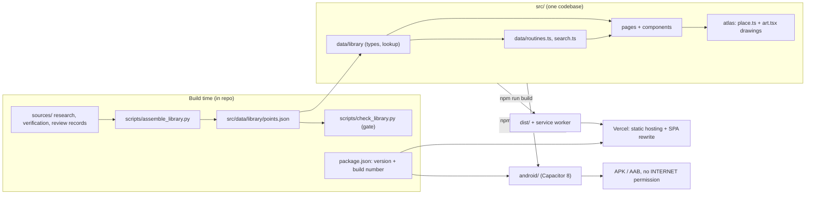
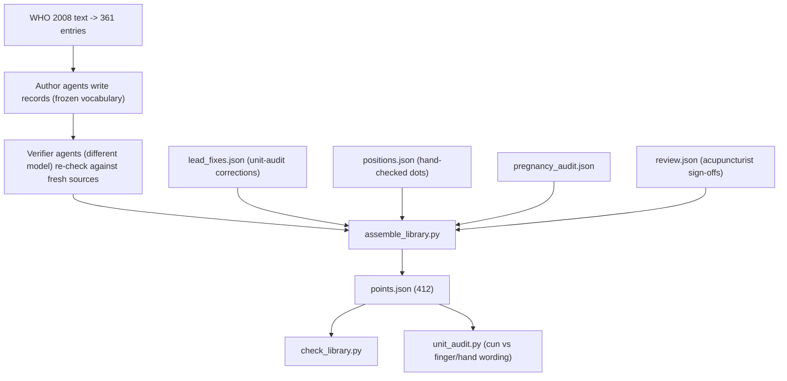
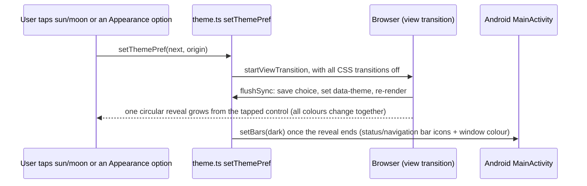
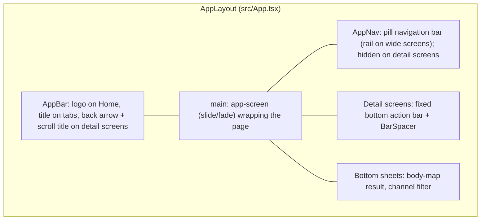
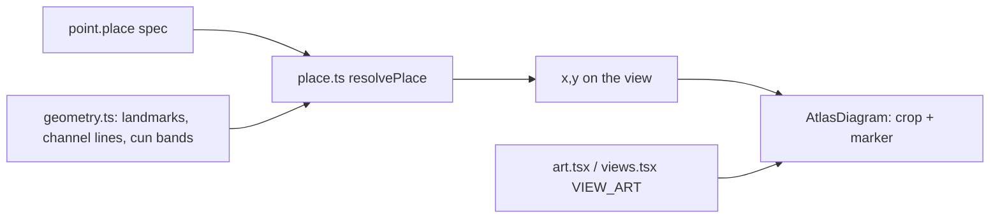

# Ease architecture

How Ease is put together and why. For setup see the [README](../README.md); for the Android app see
[android.md](android.md); for UI rules see [design-system.md](design-system.md); for data rules see
[library-pipeline.md](library-pipeline.md); for tests see [qa/README.md](../qa/README.md).

## 1. Shape of the system

Ease is a static single-page app, shipped as a **website** and as an **Android app** from one codebase. There is no
server, no database and no network call in the code. The whole library ships as one JSON file. The website uses a
service worker to work offline; the Android app holds every file inside the APK.

The only user data is three small settings kept on the device (see [Storage](#storage)). Nothing is sent anywhere.

Why static: the content is small (about 2 MB), changes only by a deliberate rebuild, and must work with no signal.
A backend would add cost, a privacy surface and an offline problem for no benefit.

## 2. Data pipeline (build time)

Phases and gates are defined in [library-pipeline.md](library-pipeline.md). The code side:

`assemble_library.py` applies, in order: verifier fixes override author fields; flashcard sites are dropped as
sources; a non-WHO point needs at least two independent references or it is left out; an indication needs at least
two counted sources; the tag table (`TAG_RULES`) maps indication keywords to symptom tags; pregnancy is true if the
author flag, the audit flag or the lower-belly/sacrum region rule says so, and the `pregnancy` caution mirrors it;
lead fixes and review results are applied last.

Each point (`LibraryPoint`, `src/data/library/index.ts`) carries: `id, code, pinyin, english, channel, area, view,
find, selfCare, technique, cautions, pregnancy, tags, tagWeight, indications, sources, evidence, place`.
`evidence` is one of `who | refs | disputed | va`. Legacy ids redirect (for example `ub40` to `bl40`) in `findPoint`.

## 3. Runtime

### Where things live

| Path | What |
|---|---|
| `src/main.tsx`, `App.tsx` | Routes, and the shell: the website shell (sticky header, tab bar, footer) or `AppLayout` (see below) |
| `src/pages/` | Home, RoutineDetail, PointDetail, AllPoints, BodyMap, Settings, Safety, About |
| `src/components/` | PointCard / PointRow / PointPicture, PressSheet, PregnancyPrompt, ThemeToggle, VersionLine, BodyFigure, BottomNav (website), Footer, `ui/*` |
| `src/components/app/` | The Android app layout: `AppChrome` (app bar, navigation bar), `barContext`, `BarSpacer`, `ChannelSheet` |
| `src/components/atlas/` | The body-view drawings and the placement engine |
| `src/data/` | `library/` (points.json, shared text, areas, photos), `routines.ts`, `search.ts`, `nav.ts`, `groups.ts` |
| `src/native.ts` | All Android glue (a no-op on the web): `isApp`, back button, links, keep-awake, native storage, splash, ripple |
| `src/theme.ts`, `src/version.ts` | Light/dark/system; version and build number |
| `android/` | The Capacitor project (manifest, icons, splash, `MainActivity`) |
| `qa/` | Browser and emulator test suites (own package) |
| `scripts/`, `sources/` | Library build and its research records |

### Routing and shell

| Route | Page |
|---|---|
| `/` | Home (search, optional pregnancy card, popular and grouped symptoms, body-map entry) |
| `/routine/:routineId` | RoutineDetail |
| `/point/:pointId` | PointDetail (and the guided press) |
| `/points` | AllPoints (`?q=`, `?area=`, channel filter) |
| `/map` | BodyMap |
| `/settings` | Settings: Appearance, Pregnancy, links to Safety and About, privacy and feedback, version |
| `/safety` | Safety guide only (urgent signs, skip/stop, how locations are checked) |
| `/about` | About: FluxoGen, version, privacy, credits |
| `/atlas-dev` | dev only: AtlasSweep |
| `*` | redirect to `/` |

Navigation is origin-aware. Links to a point pass router state `{fromRoutine, fromAllPoints, fromHome}`;
`data/nav.ts` uses it so a point page highlights the tab it was opened from. `/safety` and `/about` belong to the
Settings tab. New navigations scroll to top; back/forward keeps the browser position. `usePageTitle` gives every
route a distinct `<title>`. An unknown path or id redirects (`/point/nope` to `/points`, the rest to `/`).

### Routines and search

- `data/routines.ts` builds 23 routines: the VA handout "core" points first, then every point carrying that tag,
  ranked by `tagWeight`. A routine needs at least 3 points (`MIN_POINTS`). The `urgent` flag shows the shared
  urgent-care line for symptoms that can occasionally be serious.
- `data/search.ts` indexes names, codes, areas, channels, indications and a synonym table of everyday phrases, and
  ranks routines above individual points for symptom queries.

### Guided press

`PressSheet` is a Headless UI `Dialog`; its panel mounts `PressBody` fresh each time it opens, so a timer never
resumes stale.
- **Opens Ready.** It shows the full time and a Start button; nothing counts down until you press Start. Restart,
  Repeat and Other side also reset to full time and wait.
- **Timing.** A wall-clock deadline (survives throttled tabs), `m:ss` with ceil rounding, a 4 s in / 6 s out breathing
  dot, side 1 of 2.
- **Awake.** A screen wake lock only while running (web: Wake Lock API; Android: the keep-awake plugin).
- **Accessibility.** Three screen-reader announcements (started, halfway, finished). No vibration.
- **Small screens.** The Start/Pause row is pinned to the bottom of the screen; the ring scales with screen height;
  on a short, wide screen (landscape phone) the ring and timer sit left and the controls right.

### Pregnancy safety

`context/PregnancyContext` + `hooks/usePregnancyStatus` hold `yes | no | unset` and persist it. Nothing blocks on
`unset`. Home shows an optional card (`PregnancyPrompt`, hidden for 14 days after "Not now"); lists tag flagged
points "Avoid in pregnancy"; and a flagged point asks in place and withholds Start press until answered. With `yes`,
flagged points render a warning instead of instructions (also in routines and the press flow). The flag lives in the
data, not in components, so one rule covers every surface. The answer can be changed any time in Settings.

### Theme (light / dark / system)

`src/theme.ts` holds the choice and applies it as `data-theme` on `<html>`. The CSS `theme-dark` variant
(`src/index.css`) applies the dark tokens for either the media query (when no `data-theme` is set) or the attribute.
On the website, "System" leaves the attribute off; in the Android app the attribute is always set, because the
WebView only reads the system theme when it starts.

A theme change used to start about 200 independent colour fades while the page background snapped. The fix is to
switch everything in one frame (`data-theme-switching` disables transitions) and let the view transition animate.
System-driven changes are instant. Reduced-motion users get an instant switch. On Android the page reads the system
theme from `EaseNative.isDark()` and hears later switches as an `ease-system-theme` event (ignored if you chose
Light or Dark).

### Storage

Everything is on the device; nothing is sent anywhere.

| Key | Meaning | Where |
|---|---|---|
| `ease.pregnancyStatus` | `yes` or `no` (absent = not answered) | localStorage; on Android also mirrored to native SharedPreferences |
| `ease.theme` | `system`, `light` or `dark` | same |
| `ease.pregnancyNudge` | time you tapped "Not now" on the Home card | same |
| `sessionStorage` `ease.app` | dev-only flag to preview the app layout in a browser | never in production |

On Android native storage is the source of truth at startup (`restoreNativeState`), because the WebView writes its
own storage to disk about a second late and a fast kill could lose an answer. Backup and device transfer are off.

### Version and build number

`package.json` is the single source: `version` (for example 1.0.0) and `config.androidVersionCode` (the build number).
Vite injects the version and a short commit id (`__APP_VERSION__`, `__BUILD_ID__`); Gradle reads the same two fields.
`src/version.ts` returns the installed APK's version and build in the app (Capacitor `App.getInfo`) or the deploy's on
the web; Settings and About show "Version 1.0.0 (build 1)". In the app a "Content abc1234" line shows the web
bundle's commit, which exposes a missed `npm run android:sync`.

### Offline / PWA

`vite-plugin-pwa` (autoUpdate) precaches `js, css, html, ico, png, jpg, svg, woff2` (about 50 files, about 2.1 MB).
Fonts are self-hosted (Manrope variable). The manifest sets standalone display and maskable icons. Dev mode has no
service worker, so test offline on `npm run preview`. The native build (`--mode native`) has no service worker: the
APK already holds every file.

### Android app

The same build runs in an Android WebView through Capacitor 8, served from the APK at `https://localhost`.
`src/native.ts` holds all native glue and is a no-op on the web: back button, external links to the browser,
keep-awake during a press, native storage, splash, touch ripple. The manifest removes the INTERNET permission and
turns off backup. The app has its own layout, enabled by `<html data-app>` and the `app:` Tailwind variant, so the
website is untouched:

A detail screen gives the bar its title and back target with `<AppBarTitle>`. Back is "previous screen if there is
one, else its parent". Details, native behaviour and the Play checklist: [android.md](android.md).

## 4. Placement engine (pictures)

Each point has a `view` (one of 19 drawings) and a `place` spec taken from its WHO measurement. Drawings are original
SVG; nothing is traced from third-party art.

Spec kinds: `at` a landmark; `from` a landmark by cun up/down/out/in; `line` along a channel line by cun; `between`
two landmarks by fraction; `manual` (fingers, toes, ear, face detail) resolved from `positions.json` hand-checked
coordinates. Positive cun means toward the trunk/head; on head-top, `up` means toward the back of the head.
Reference-only points get a rose crossed marker, never the accent "press here" dot. VA zones with handout photos use
`PointPicture` to show the photo. The crop window cuts through the drawing (a thumb, a knuckle line), so its edges
fade softly into the card (an SVG mask); the marker is drawn on top and stays crisp. The vocabulary of landmarks and
lines is frozen in [placement-vocab.json](placement-vocab.json); `/atlas-dev` shows all of it at once.

## 5. UI system

- **Tokens**: `src/index.css` defines semantic roles (paper, card, ink, line, accent, ok, info, caution, stop,
  atlas-*) once for light and once for dark, exposed to Tailwind through `@theme inline`. Components use role classes
  only; `scripts/contrast_check.mjs` enforces WCAG AA on every pair. Dark is a warm charcoal (not green-black).
- **Custom variants**: `wide`, `app` and `web` (all in `index.css`), and `theme-dark`.
- **`wide`**: tablet/desktop chrome at width >= 48rem, or a short landscape phone (height <= 500px and width >=
  560px). Written as two blocks because comma media lists were silently dropped.
- **rem vs px in media queries**: `rem` inside a media query follows the user's font size, so "31.25rem tall" becomes
  1000 px at 2x text and a tall portrait phone would count as "short". The short-screen test is therefore in **px**;
  the width test for `wide` stays in rem on purpose (large text keeps tablets on the phone layout).
- **Components**: `ui/Button`, `Chip`, `ChipScroller` (reveals the selected chip only when selection changes),
  `DotRings`, `InfoCard`, `list.ts` (grouped list surface); `BodyFigure`; `BottomNav` (website, hides on scroll);
  `PointCard/Row/Picture`.
- **Accessibility**: landmarks, 44 px targets, visible focus, reduced motion, text up to 200%, axe clean.

## 6. Decisions

| Decision | Why | Trade-off |
|---|---|---|
| Static JSON, no backend | Offline, private, cheap | Content changes need a rebuild and deploy |
| Generated `points.json` | One audited path from sources to UI | Must rerun assemble + check after any source change |
| WHO 2008 as location authority | Public, standard, citable | Wording is paraphrased; WHO is silent on a few points |
| Different model verifies | Independent errors are caught | Shared textbook lineage limits true independence |
| Keep unsafe points as reference only | Library is exhaustive without inviting harm | Extra UI state (rose marker, no technique) |
| Pregnancy flag in data | One rule everywhere | Flag errors propagate everywhere, so it was audited twice |
| Pregnancy question is optional and in place, not a pop-up | A blocking question on first launch felt imposing | A flagged point must ask later; Start is withheld until answered |
| Original drawings placed by cun | No license risk, consistent | Schematic, not anatomical; needs expert review |
| Shared text table | No repeated paragraphs, one place to fix | Points need a lookup |
| No vibration | Product decision | none |
| One codebase, a separate app layout behind `data-app` | The app should feel native without forking the code or touching the website | Two layouts to keep in step; QA covers both |
| Capacitor, bundled files, no INTERNET permission | Offline by construction; strong privacy story | A web change needs `npm run android:sync` and a new release |
| One view transition for the theme switch | All colours change in one frame | Needs a Chromium-class WebView (instant switch elsewhere) |
| Version in `package.json`, read by Gradle | App, website and Play listing cannot drift | Bump `androidVersionCode` by hand per upload |
| QA in its own package (`qa/`) | The app stays dependency-light | Separate `npm run qa:install` |

## 7. Extending

- **Add or change a point**: edit research records in `sources/library-research/`, run
  `python3 scripts/assemble_library.py && python3 scripts/check_library.py`, then open `/atlas-dev`.
- **Add a symptom routine**: add a tag rule in `TAG_RULES`, add the id and copy in `data/routines.ts` (and a
  group/synonym in `data/groups.ts`, `data/search.ts`), rebuild the library.
- **Add a body view**: draw it in `atlas/art.tsx`, register it in `views.tsx`, add landmarks and lines in
  `geometry.ts` and `placement-vocab.json`.
- **Add a setting**: store it like `src/theme.ts` (localStorage plus `persistNative`), add its key to `PERSISTED_KEYS`
  in `src/native.ts`, add a control in `pages/Settings.tsx`, and **update the privacy policy** in FluxoGen/legal and
  `docs/android.md` (it lists what the app stores).
- **Add a screen**: a route in `main.tsx`; for the app layout, a title in `AppChrome` (tab) or `<AppBarTitle>`
  (detail), and add the route to `isDetail` if it should hide the navigation bar. Add it to the QA route lists.
- **Change colors**: edit tokens in `index.css` for both schemes, then `npm run check`.
- **Release**: raise `config.androidVersionCode` in `package.json`, then follow [android.md](android.md).
- **Record an acupuncturist review**: see the README (CSV, `import_review.py`, assemble, check).

## 8. Known limits

- No licensed acupuncturist review yet (stated in the app).
- QA runs on emulators only (Android 17, WebView 153); no real-device runs yet. Firefox is untested.
- VA photos have no marker; leg drawings lack drawn knee and ankle.
- On a very short landscape phone at 2x text the point screen is cramped (scrollable).
